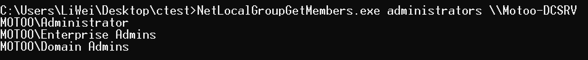
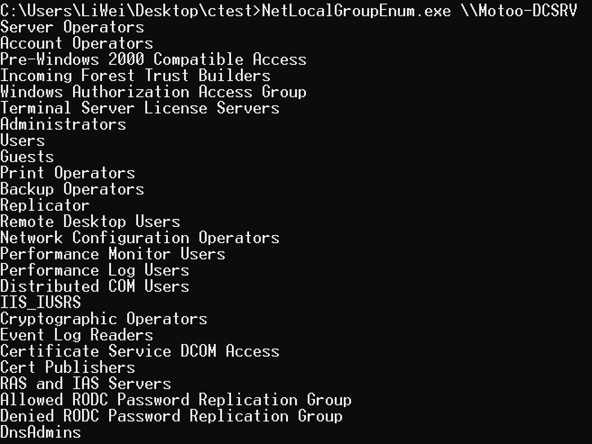
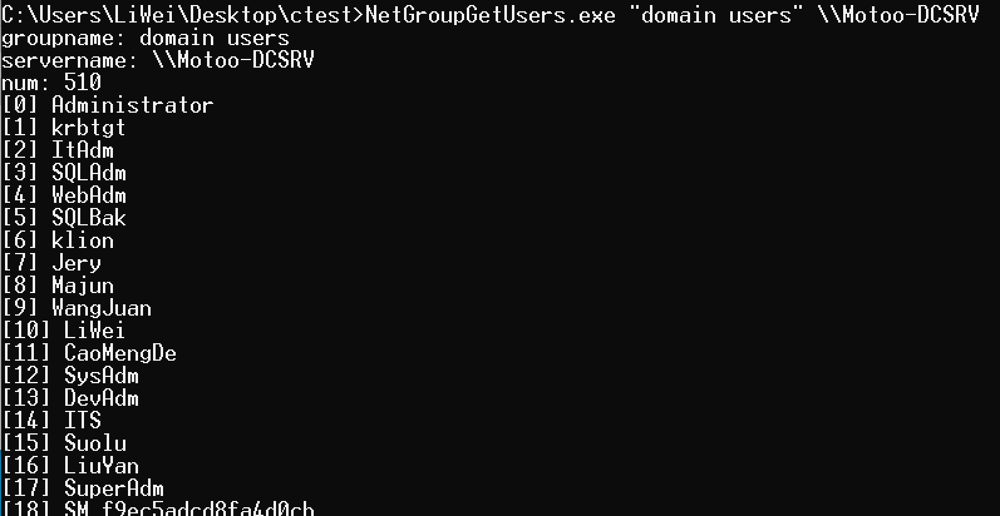
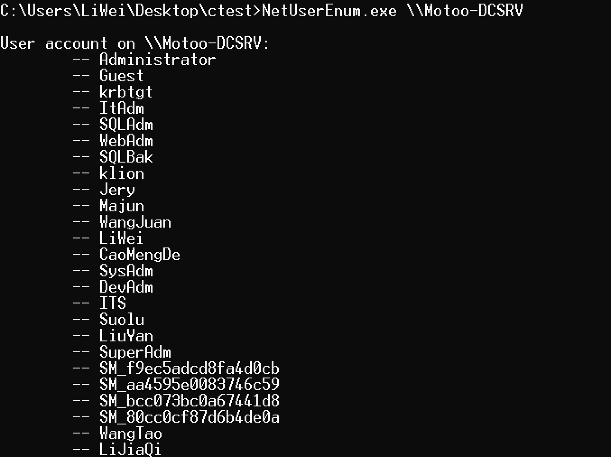
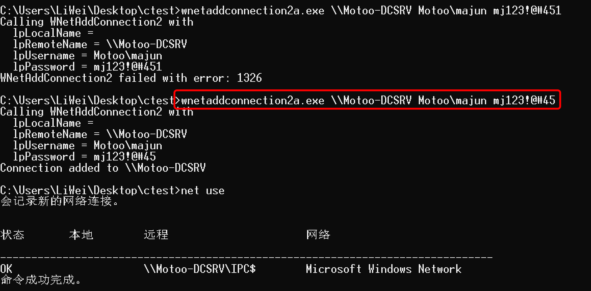
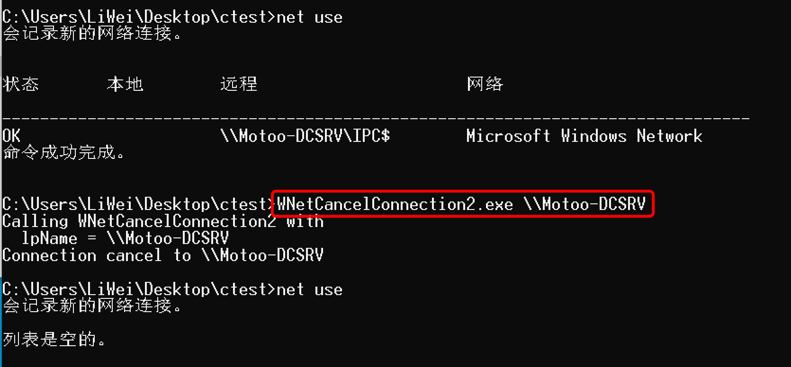
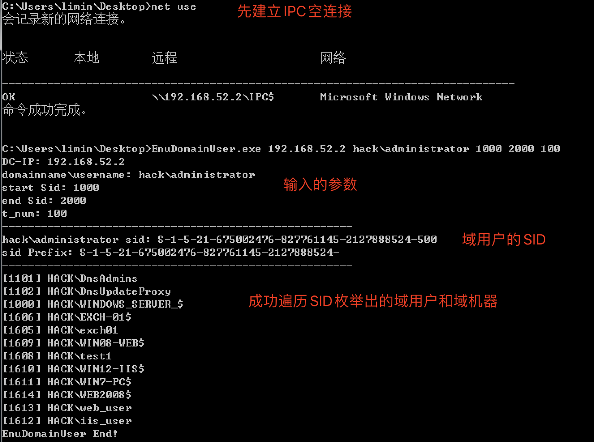
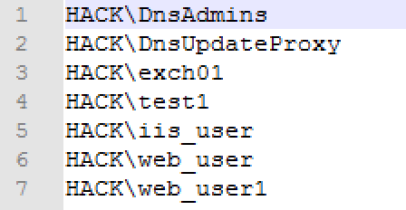
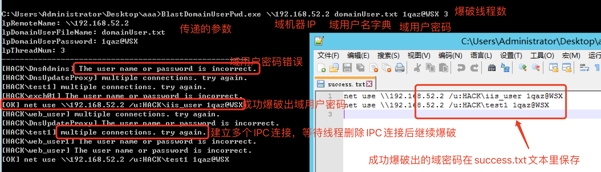
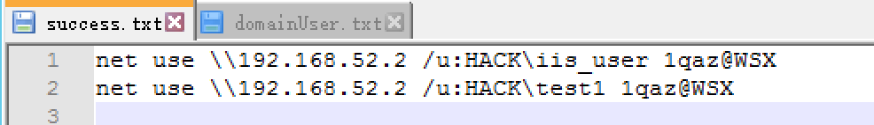

# 我的C++学习过程-编写的域渗透小工具

## 0x01. NetLocalGroupGetMembers

功能：查询目标服务器本地管理组的成员



## 0x02. NetLocalGroupEnum

功能：返回指定服务器上的所有本地组



## 0x03. NetGroupGetUsers

功能：返回指定服务器指定组的所有成员

查询域里的各个组里的成员，IP必须是域控IP



## 0x04. NetUserEnum

功能：查询目标服务器所有用户，包括隐藏用户



## 0x05. wnetaddconnection2a

功能：建立IPC连接，可以将目标共享目录映射到本地磁盘



## 0x06. WNetCancelConnection2

功能：删除IPC连接



## 0x07. EnuDomainUser

功能：枚举域用户

### 1. 介绍

适用于：当前边界机器权限是工作组机器，通过nltest或者nbtscan等工具发现内网有域环境，并且找到域控IP，但是没有域用户的权限下渗透思路。

前提条件：能够和域控建立空连接

实现原理：域管默认都会有administrator用户，通过windows api查出administrator域管的SID，然后遍历SID范围，枚举出域成员（域用户和域机器）。

SID范围：域用户和域机器的SID一般是1000以上，所以使用工具的时候遍历1000以上的SID

### 2. 工具使用

使用帮助：

```
C:\Users\Administrator\Desktop>EnuDomainUser.exe
Usage: EnuDomainUser.exe <DC-IP> <domainname\username> <start Sid> <end Sid> <t_num>
       EnuDomainUser.exe \\192.168.52.2 hack\administrator 1000 2000 100
       EnuDomainUser.exe \\域控IP 域名\域用户名<默认administrator> 起始Sid 末尾Sid 多线程数目
```

使用demo：

`EnuDomainUser.exe 192.168.52.2 hack\administrator 1000 2000 100`

参数解释：

```
192.168.52.2  是域控IP
hack          是域名
administrator 是域管默认用户
1000          是遍历SID的起始
2000          是遍历SID的末尾-可以设置高一点，例如10000，20000等
100           是多线程的数目
```




## 0x08. BlastDomainUserPwd

功能：爆破域用户密码

### 1. 介绍

通过IPC连接->爆破域用户的密码


结合EnuDomainUser工具或者kerbrute工具获取域用户名列表，然后进行爆破


如果被360杀，改一下exe名字即可

设计思路：

1. 如果能够和域控建立空连接，则用EnuDomainUser工具枚举遍历出所有域用户名

2. 如果不能够和域控建立空连接，则用kerbrute工具爆破域用户名

当获取到一批域用户名后，开始尝试域用户密码的弱口令爆破

域用户密码有强度要求，则尝试爆破强弱口令。例如：P@ssw0rd、1qaz@WSX等

### 2. 工具的使用

```
Usage: BlastDomainUserPwd.exe <domainComputerIp> <domainUser.txt> <password> <t_num>
       BlastDomainUserPwd.exe \\192.168.52.29 domainUser.txt password 100
       BlastDomainUserPwd.exe \\域机器IP 域用户名字典 尝试爆破的密码 多线程数目
```

域用户名字典格式规范：域名\域用户名

 `domain\user`




运行实例： `BlastDomainUserPwd.exe \\192.168.52.2 domainUser.txt 1qaz@WSX 3`



成功爆破出的域用户密码保存在当前目录的success.txt文本里




## 0x09. SchtaskBackDoorWebshell

功能：计划任务维持webshell

### 1. 适用场景：

护网中被防守方发现webshell，并清除出去，漏洞也被修复，然后网站恢复后不能再上传webshell时，通过计划任务重写webshell。

### 2. 条件：

管理员权限，因为创建计划任务得需要管理员权限

### 3. 使用方法：

xxxx.exe c:\wwww\upload\1.jsp

### 4. 实现过程：

将c:\wwww\upload\1.jsp内容复制到c:\windows\temp\tempsh.txt里，然后创建了一个计划任务，执行的命令是`c:\windows\system32\cmd.exe /c copy c:\windows\temp\tempsh.txt c:\wwww\upload\1.jsp`，每半小时触发一次。

### 5. 视频展示：


## 0x10. regeditBypassUAC

功能：过uac执行exe，编译好的exe只适用于win10，win7不行

### 1. 具体过程

[基于白名单程序注册表bypassUAC](./regeditBypassUAC/README.md)

### 2. 视频演示


## 0x11. delegationVul

功能：检测内网域的约束委派

### 1. 约束委派利用

[约束委派利用](./delegationVul/约束委派利用.md)

### 2. 视频演示


### 3. 基于资源的约束委派利用

[基于资源的约束委派利用](./delegationVul/基于资源的约束委派利用.md)

### 4. 视频演示

